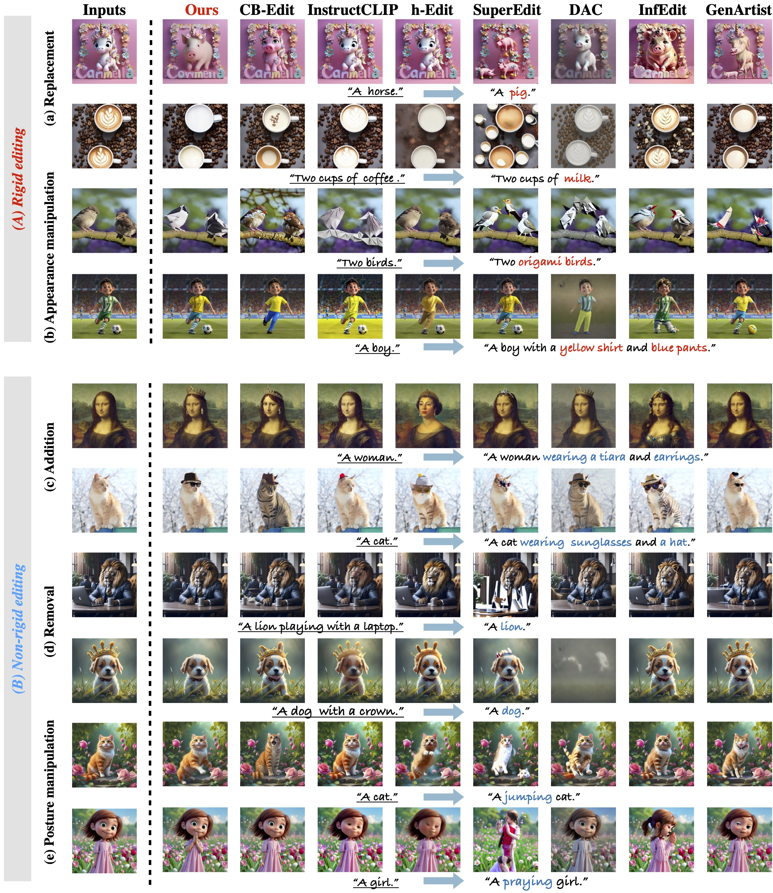
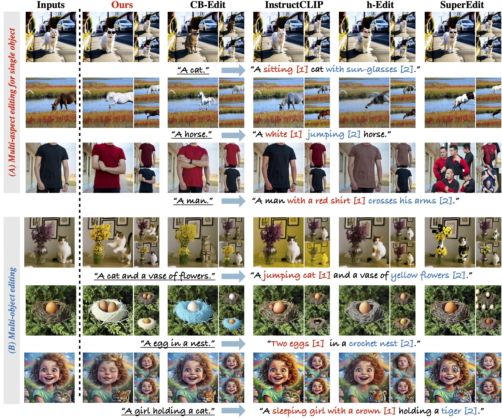

# A-Disen 
This repository contains the official implementation of the paper "Associating and Disentangling Foreground-Background for Text-based Image
Editing".

## 📖 Introduction
Text-based image editing, which aims to modify images with different complex rigid and non-rigid variations w.r.t the given text, has recently attracted extensive interest. Existing works are typically either global-entangled or hard-disentangled paradigms to implicitly or explicitly separate foreground and background, 
 but neglect the intrinsic associated interaction between foreground-background, leading to inaccurate disentanglement during the dynamic denoising process and a trade-off between foreground editability and background fidelity. In this paper, we propose a novel Associated-Disentangled attention framework (A-Disen), 
which explicitly models the associated interaction and step-wise dynamic disentanglement of foreground-background at each generation step, and thus achieves comprehensive improvements of editability and fidelity. Specifically, we design (1) dual branch negative-gating associated attention module, which innovatively transforms foreground negative attention into an inhibitory gating signal to regulate background attention, enabling more accurate and dynamic disentanglement in an associated-learning manner. 
 (2) Token-prior disentangled contrastive loss, which is designed based on the internal encoding pattern of textual cross-attention on foreground-background regions, to provide accurate token-level priors guidance for supervising foreground-background attention learning, and finally facilitates the associated-attention module. Comprehensive experiments demonstrate our superiority, exhibiting unprecedented editability on text guidance and fidelity on text-irrelevant image details.

 

 

## ✨ News ✨
- [2026/03/31]  We release the code for LayerEdit! Let's edit together! 🎉 🎉

## TODO List 📅
- [x] Release environment setup
- [x] Release training and inference code on SDXL backbone
- [ ] Release training and inference code on FLUX backbone

## ⚡️ Quick Start

### 🔧 Requirements and Installation

Install the requirements
```bash
conda create -n ADisen python=3.10.12
conda activate ADisen
pip install -r requirements.txt
accelerate config
```

### ✍️ Editing a image
```bash
export MODEL_NAME="stabilityai/stable-diffusion-xl-base-1.0"
accelerate launch src/diffusers_data_pipeline_my_sdxl.py \
          --pretrained_model_name_or_path=$MODEL_NAME  \
          --instance_data_dir=/home/fufy/image-editing/datasets/paper-test-img/gen_project/cat2.jpg   \
          --output_dir=./logs_try_cat_0314 \
          --real_prior --prior_loss_weight=1.0 \
          --instance_prompt="photo of a cat"  \
          --class_prompt="cat" \
          --resolution=1024  \
          --train_batch_size=1  \
          --learning_rate=1e-5  \
          --lr_warmup_steps=0 \
          --inner_steps=30 \
          --ddim_steps=30 \
          --num_class_images=200 \
          --scale_lr    \
          --FT_KV \
          --FT_out \
          --NA_pro \
          --Attn_loss_pro \
          --Img_Emb_pro 'type2-2-vgg-sum' \
```

## Applications  

### 💡Single-Editing

 

### 💡Multi-Editing

 
